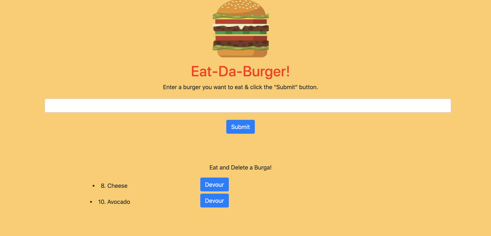

# treadEatDaBurgerApp

# The What!
Hello all!  This applicaiton is a simple Burger App!  It allows the user to keep track of what burgers they have eaten and would like to eat.  

# The How?
This applicaiton is very simple to use.  Once the app is loaded, use the input field to type in the burger you would like to eat.  Its that easy!  Once you press the submit button, the burger will be recorded below.  Go crazy!  There is no limit to how many burgers you can record.  But be sure to enter in something, the application won't allow you to submit without an entry.  After you have recorded your burger to eat, simply press "Devour" and it will be eaten.  The burgers on the right of the page are a record of each burger you have eaten.  If you select delete, it will be removed for your list. 

# The Why?

Because its fun!  Besides, who doesn't like keeping track of delicious burgers.

# The Where?

Try the app out here!  [Insert Link].

# The Who

This applicaiton is maintained by myself.  I can be reached for contributions, or questions here:

johnsondavid1107@gmail.com

